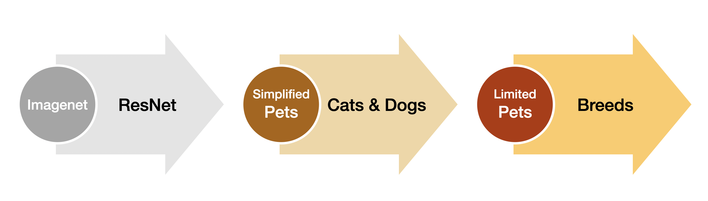

# FastLabeling

Anyone can recognize cats and dogs but it's a diffeerent story to recognize all different breeds. Sometime domain expertise to corretly label data costs too much and it may be necessary to reduce that effort in a project.

I've experimented in this sample repo how to adapt the famous ULMFiT two steps fine tuning process to the image domain pursuing the goal of reducing the cost of labeling datasets.

The two different notebooks fine tune a ResNet model pre-trained on ImageNet with modified MNIST and Oxford Pets Datasets and simplified labels first and then implement a final fine tuning with the original label sets provided only for a minimal number of samples.

All experiments are built using Fast.AI v2

## MNIST test

- Fine tune first the resnet model on modified MNIST dataset with only Even and Odd labels
- Change the final layer for 10 digit classification scenario
- Fine tune again the Even/Odd trained model providing only a very small subset of the original MNIST labeled data

## PETS test

- Fine tune first the resnet model on modified PETS dataset with only Cats and Dogs labels
- Change the final layer for the full breed classification scenario
- Fine tune again the Cats/Dogs trained model providing only a very small subset of the original PETS labeled data

# Results

With the MNIST dataset, fine tuning first for simple Even and Odd labels and then fine tuning again for the ten digits classifier task but feeding only 60 samples per class, instead of the usual 6000, the final accuracy on the full validation dataset (10K samples) is 0.9756.  

Of course quite far away from SOTA results on this dataset, but I would say it's not too bad considering having provided real digit labels for only 2 orders of magnitude less.
